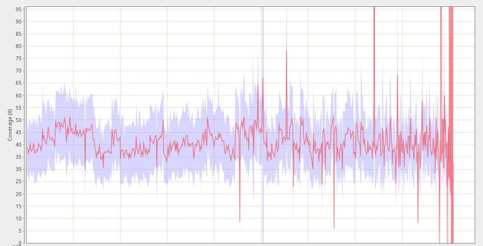
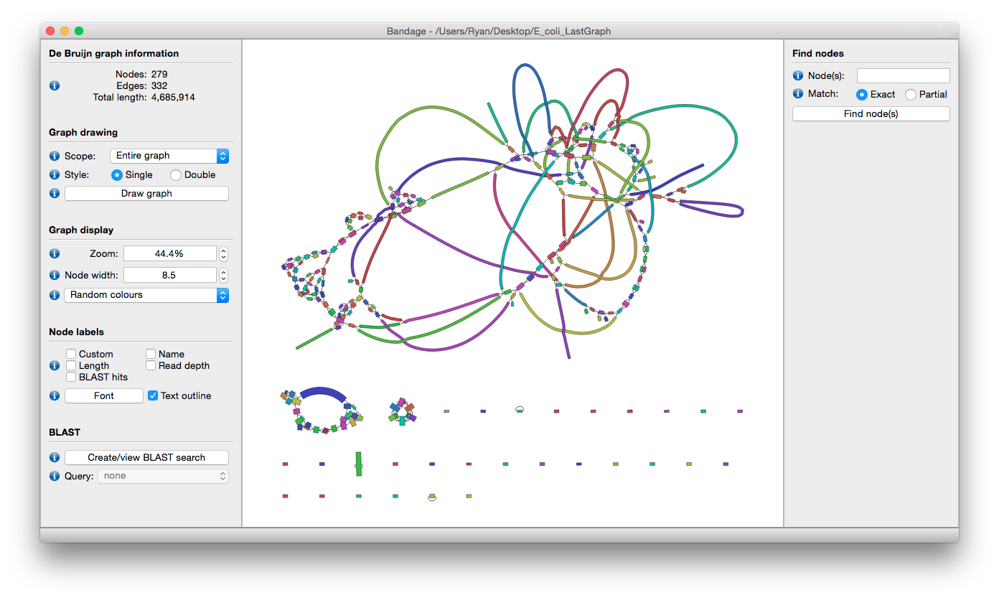

# The situation

Currently the lesson features the following components:

Aspect              | Currently
-----               | ----------
Learning Outcomes   | LO1) Compute and interpret a whole genome assembly, LO2) Judge the quality of a genome assembly.
Learning Activities | Conda (LO1), Spades (LO1), Qualimap (LO2), Comparison (LO2)
Assessment          | k-mer exploration (no LOs.)

These are organised in the lecture as:

- An introductory lecture over genome assembly techniques
- Demonstration of assembly
- A hands-on portion where students run the assemblies (LO1)
	- Here students run "Conda", "Spades"
- Discussion of genome quality (LO2)
	- Here we do "Qualimap", "Comparison"
- Some formative assessments over their impressions of genome assembly qualities

# Areas for Improvement

This results in very poor coherence currently; the described outcome "compute and interpret a whole genome assembly" was marginally achieved, though the 'interpret' step is somewhat lacking. However LO2 is missing very key components:

- There is minimal discussion of quality metrics, and what constitutes a good or bad result.
- There are no examples of Good, Mediocre, or Bad assemblies>
- While visualisations are available, they are not used.
- The data is assembled twice, with two different settings, which result in essentially indistinguishable results (to a trained eye!).

And this needs to be significantly improved, there are numerous low-hanging fruit which can be addressed. Additionally the assessment portion involves a take-home homework problem set is very theoretical, incredibly abstract, and related to genome assembly at a very low level. This hampers students applying knowledge obtained in class to effectively meet the learning outcomes.

# Context of the Lesson

This lesson is part of the 3rd year course of BML where students need to obtain such skills as:

> - Computer skills: [...] bio-informatics tools, [...]
> - Research skills: problem analysis, research questions, [...]

And exists within the Minor Bioinformatica as a 2 EC class, where students are expected to:

> [...] you will focus on handling, storing, retrieving and visualizing massive amounts of biological data. While data generation is faster than data management, visualization gets more and more important. [...]

# Improving Lesson-Context Coherence

The above context section gets to the core of the problem.

But here we analyse two relatively small genomes, this should be scaled up
significantly across more samples to truly meet the goals of the course.
This would additionally let us introduce variety of data, good to bad, and
let the students separate those based on their quality scoring criteria like the N50, average read depth, or regions of low read depth as seen in Figure \ref{fig:qualimap}.
On top of that, we fail to exercise good visualisation of the results that are readily available such as via Bandage (Figure \ref{fig:bandage}, [@10.1093/bioinformatics/btv383]), and need
to introduce that so students have better comprehension of an incredibly
abstract topic.

Students do not get the chance to explore the problem space themselves and
optimise the results, something that would be improved with integration of more
and larger datasets, allowing students to practice problem analysis and
analysing questions applicable to later research.

# Content Improvement Plan

The initial part of the lesson covering assembly background is useful
theoretical knowledge for students and should be kept, but maybe augmented with
student activities like "assembling" some sentence of text, to give students an
idea of what machines do in the background. Especially if students are expected to understand k-mers.
This activity is visualised in Figure \ref{fig:activity}.

- Item 1: Text assembly activity, students split into 3 groups, and get to assemble a sentence split with different K-mer values to understand consequences.

![A screenshot from the slide deck covering assembly, this would be turned into an activity. Students would be split into three groups, each group with a different read length (i.e. k-mer), and each group would try and re-assemble the original text based on a pile of papers handed to them. This could be conducted with text in any language, even intentionally in a language students don't speak, to help them remove the effects of previous knowledge on solving the puzzle. One group would have 5-mers and would struggle, the other 7-mers and do better but still struggle with some repeats, and the last would have something longer like 15-mers to experience how that improves the process. The activity as written is equivalent to short and long read single-end sequencing, but we could use it as well to introduce paired-end sequencing, via another round of short-read sequencing but with paired-end results (i.e. 5 letters, a gap of 10, another 5 letters as one piece of paper.)\label{fig:activity}](./activity.png)

Next, the lesson needs to expand to include a section on evaluation of genomes by
quality metrics as well as a discussion of those major quality metrics that
are used in the field.

- Item 2: (Short) presentation of quality metrics (e.g. N50, Bandage), explanations of their meaning, and then good vs bad results.

Finally during the lesson, we will replace the dataset we're using such that we
can have multiple assemblies of various resulting qualities. Potentially this
can be done through a small workflow further exercising bioinformatics skills
they need in the workplaces of their future employers.

- Item 3: More, smaller genomes of varying quality, tasking students to return with a ranking of best to worst assemblies.

Lastly the assessments must be augmented, discussing k-mer contributions is good but not sufficient. This must be expanded to include a further assembly and quality evaluation, asking them to explore the parameter space on their own: which parameters resulted in the best assembly? Why do they think that is the best possible assembly given the data?

# Updated Learning Objectives

- Compute multiple whole genome assemblies in such a way to develop big data processing skills (Apply+Procedural)
- Learn to evaluate quality metrics so that they can separate good and bad assemblies (Analyse+Conceptual, Evaluate+Procedural)
- Visualise assemblies so that they understand presentation of various failure modes (Apply+Procedural, Evaluate+Conceptual)

# Lesson Re-design

Students will attend this lesson with previous theoretical experience doing assemblies, this portion is a review for them. They have gone through the motions of assembly but not done it by hand, nor understood the intricacies of parameter selection. Students at this stage in their career are planning to go on to a company or research institute where they will need to apply these skills to analyse genomic sequences and help coordinate and design sequencing projects. When those sequencing experiments occasionally fail for various reasons, they will need to understand why they failed and how to resolve those issues, be it parameter exploration or resequencing. This lesson should serve students well as a very practical lesson delving into comparative analysis which provides key information for them.

The above described updated learning objectives will allow students to efficiently approach targeted skills and knowledge as described in the minor bioinformatic and BML programmes above. This lesson falls near the end of their curriculum and as such can spend more time focused on an in-depth understanding of assemblies and their associated failure modes. The module is titled "Computational Biology", which is furthered through their development of genome assembly skills and computational scaling of analyses across multiple samples, and visualisation thereof. This is a task of which they need to become Intermediate practitioners, in both knowledge and application, within the 2ECs available. By this point in their career they have already become Novices with assembly and genomics as topics, letting them now deepen their knowledge and meet overall Minor Bioinformatica Learning Objectives such as massive data handling and visualisation.

This lesson's theme is assembly which is supported through several phases and materials:
1. an assembly activity
2. an initial presentation on assembly
3. a demonstration portion
4. a hands-on portion where students work in duos to assemble multiple genomes
5. a subsequent presentation on quality metrics and visualisation
6. a further hands on where students apply metrics, visualise, and evaluate all genomes for quality
7. a group discussion of the results

These will be matched formative assessments in the form of homework problems which they need to resolve on their own given knowledge from the lesson. Here they will be tasked with assembling a genome and exploring the parameter options to optimise the resulting assembly. This will be complemented with a discussion section where they should explain why they've chosen those specific parameters to modify. This will aim to assess their ability to independently answer research questions.

The work forms used in this redesigned lesson will involve lectures, problem based learning (genome assembly with real world data), group work in duos (assembly, quality evaluation), and finally group discussion with peer teaching (as students will explain which one is better and why to each other.) The in class teaching time is 2.5 hours which should allow plenty of time for varied work forms to help students achieve learning goals.
