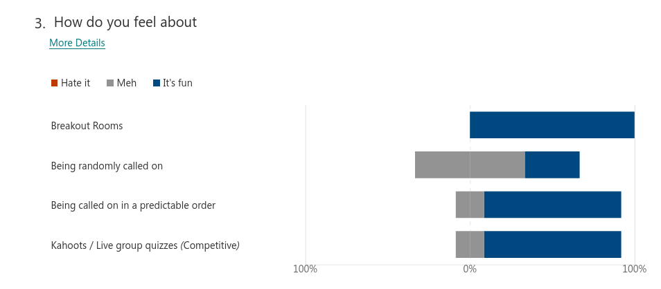

# Points of Attention

Given that my lessons continue to be online, I find myself quite concerned about whether or not students are getting enough support and personal attention, and receiving it in ways that work optimally for them. I know that students can feel significantly isolated with working from home constantly, and that I want to ensure that I'm a friendly and accepting person that they feel comfortable contacting when they have issues. Specifically I've heard occasionally that I go too quickly and sought their suggestions for how to fix this--I don't notice it unless someone says it, and I'd rather they say it at the time it's happening.

# Questionnaire

I designed the enquête to measure a couple aspects of this communication:

- Preferred method(s)
- Preferred interaction modalities
- Their experiences as students in my class
- And their feelings on my interactions with them until now.

These aspects I found to be particularly important to me and my interactions with students. I elaborated these with the following survey design:

Question | Aspect      | Text
--       | ---         | ---------------
1        | Question    | How comfortable do you feel discussing course questions, issues, programming questions via
1        | Description | Example questions include: where's the course recording, why is my code failing, what do you mean I need to import that first
1        | Answer      | A choice matrix of [Email, Teams Text Chat, Teams Video Chat, In person] and [Please no!, If I must, Meh, It's ok, Yes please, My preferred way!]
2        | Question    | I find online classes ....
2        | Description | 1 = They work great for me! 5 = It's so exhausted I hate it here
2        | Answer      | Likert-type scale (1-5)
3        | Question    | How do you feel about
3        | Answer      | Choice matrix of [Breakout rooms, being randomly called on, being predictably called on, Kahoots / Competitive quizzes] and feeling matrix of [Hate it, Meh, It's fun]
4        | Question    | Helena wants to discuss my solution in front of the class, that makes me feel
4        | Answer      | Free text
5        | Question    | Some of you have commented I go too quickly, how can we address this?
5        | Description | I'm guessing you don't want to publicly speak up? Would you want to message the TOA who can ask me to slow down? Is there something I can do to make you feel ok asking me to slow down in front of your peers? (I need the reminder, I get too focused on covering content, for sure.)
5        | Answer      | Free text
6        | Question    | I feel like part of the class when <blank>?
6        | Description | i.e. specific types of activities (and that I'm getting something more useful out of being here rather than doing chores or something else.)
6        | Answer      | Free text
7        | Question    | Any other remarks?
7        | Answer      | Free text
8        | Question    | Are you getting the support you need? Do you have the resources you need?
8        | Answer      | Likert-type scale with stars (1-5)
9        | Question    | Final Remarks?
9        | Answer      | Free text

## Results

### Question 1

This focused on communication, which gave rather optimistic responses for the second year of a pandemic

### Question 2

Students overall rated online classes as an ok experience (min=1, mean=2, max=4, sd=1), only one student gave a higher rating of 4 out of 5 (five being they're exhausted and hate it online), but this shows suboptimal study design as I've conflated "lack of enjoyment" and "exhaustion" which I expect many of us are experiencing, and it's unclear *why* the student responded like they did.

### Question 3

### Question 4

The variety of responses have been interesting to say the least. To summarize the main points of the students:

- Some worried because they were beginners, and know that their answer won't be correct.
- Some feel very seen, that the teacher takes time to interact and discuss their answer.
- Most felt ok with it, knowing that it was a necessary part of the learning process.

Seeing these responses, and given that this is a technical course where we have a significant amount of control over where the students execute code, I've asked my TOA to look into automating the collection of student solutions to a given problem in a way that I can use it dynamically during class. That will allow me to discuss student solutions with the class anonymously and maybe achieve everyone's objectives: no hurt feelings, no uncomfortable attention, and the student's solutions we review will still feel seen.

### Question 5

This again gave food for thought on potential options to slow down, some more actionable than others

- All steps should be repeated twice.
- It's unclear when steps are something we need to run, or just for explanation.
- I don't want to slow down just for me, knowing other people have the same issue helps
- Sometimes you make a mistake, and catching up is tough, but the recording helps.
- No problem with speed.

### Question 6

Here I interrogated their community spirit, in case there was anything I could do to help there

- Answering questions together (x3)
- Breakout rooms & Exercises (x3)
- People speak up

I really appreciated the insight of one student's response there:

> People need to be more interactive. Nobody responds when you ask a question. [...] But I think it also can be frustrating for you that nobody is responding.

Which I have to concur with.

### Question 7

This had the most important point for me

- Lessons are great, sometimes a bit too fast
- I really think you are a great teacher already to be honest!
- I found it difficult to do the assignments with you 1:1, because I don't understand the assignments immediately and sometimes can feel like I am too slow.

That third point will be a focus of the reflection section below.

### Question 8

Students were absolutely getting the support they need (min=4, max=5, mean=4.666, stdev=0.47)

### Question 9

The final other remarks section and not well responded to, which is expected given that many people expressed opinions in 6.

## Reflection

### Situation: Review

Numerous students across numerous questions, in this survey and the previous, noted issues with the speed of lessons. Here either they needed more review of individual things I mentioned (repeating instructions) or more in depth discussion of the exercises which students worked through on their own. While those exercises have solutions available to students as they work through them, some additional discussion is clearly beneficial.

#### Looking Back

During the times this happened during class I saw no indication it was needed. No students reported it, the TOA didn't mention it to me, and during exercises the students appeared to be completing them at the expected pace and with the expected success rate. I thought it was going ok for everyone, however their survey results indicate they don't feel the same.

#### Awareness

To me this feels somewhere between an abject failure (not knowing well enough what is going on with the students) and perfectly acceptable (students won't get things immediately, and will need to practice more later). This leaves me feeling a bit confused as to what the real situation is. I value being approachable to students which feels bad if they don't feel comfortable speaking up in front of their peers when it's too fast.

#### Alternatives

In the future I can interrogate students more regularly as to how they're feeling. This comes at the cost of precious class time, but if the students answer and can give a more accurate assessment of their feeling, then it's worth it.
Additionally I can embed more anonymous methods for feedback within the course days (either via Teams or otherwise) to let students indicate their feelings of the speed of the content and their understanding which comes at the expense of more work, more setup time for classes required. However again, maybe it produces a useful result which will make the extra time worth it.

#### Trials

I will start by going through the steps of every exercise twice to help the students who feel like they got lost along the way. Additionally I'll start regularly sending MS Forms polls in the chat to ask how students are feeling and if it's an ok pace or too fast or slow. I need to see if I can automate this, because it takes a bit of time to setup which distracts from the class. I want to watch out that it's actually an issue of me going too quickly, and not just students keeping up but needing more review time than was available during class.

### Situation: Experience Gap

During one class we had an odd number of students. I have been doing breakout rooms exclusively with duos, as I wanted them to learn the corporate skill of pair programming. Given the odd student count, I decided I'd pair with the leftover student myself so they could be included in the activity. I paired with two different students during that class period, so, thankfully the student remains anonymous:

> I found it difficult to do the assignments with you 1:1, because I don't understand the assignments immediately and sometimes can feel like I am to slow. It would have helped if I got a bit more time to try it myself and read the question I think. (The 1:1 itself doesn't bother me tho)

I should have paired them with someone on their own level, rather than attempting to participate due the huge disparity in skill levels which naturally led to blindspots where they did not understand the exercise and I continued forward.

#### Looking Back

#### Awareness

#### Alternatives

#### Trials

- difficult 1:1

4. Process and describe the results and reflect on them via a reflection model of your choice.

# Action Points

- Go through questions at the end of each exercise section.
- Go through student solutions anonymously and discuss common problems.
- Do not pair with students, the knowledge gap is too significant, instead have them form trios.

5. Formulate action points: to what and how do you want to work in relation to the teacher-student relationship?
